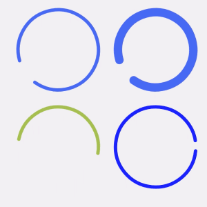

# A circular progressbar with sweeping angle


## usage

In build.gradle config dependency.

``` groovy
compile 'org.quanqi:CircularProgress:1.0.2'
```

In laout xml

``` xml
<org.quanqi.circularprogress.CircularProgressView
    android:layout_width="100dp"
    android:layout_height="100dp"
    android:layout_margin="8dp"
    app:angleAnimationDurationMillis="@integer/circular_default_angleAnimationDurationMillis"
    app:borderWidth="@dimen/circular_default_border_width"
    app:colorSequence="@array/circular_default_color_sequence"
    app:sweepAnimationDurationMillis="@integer/circular_default_sweepAnimationDuration" />
```

## LICENSE
Copyright (c) 2014, Cindy(jing@quanqi.org)

```
THIS SOFTWARE IS PROVIDED BY THE COPYRIGHT HOLDERS AND CONTRIBUTORS "AS IS"
AND ANY EXPRESS OR IMPLIED WARRANTIES, INCLUDING, BUT NOT LIMITED TO,
THE IMPLIED WARRANTIES OF MERCHANTABILITY AND FITNESS FOR A PARTICULAR PURPOSE ARE DISCLAIMED.
IN NO EVENT SHALL THE COPYRIGHT HOLDER OR CONTRIBUTORS BE LIABLE FOR ANY DIRECT, INDIRECT,
INCIDENTAL, SPECIAL, EXEMPLARY, OR CONSEQUENTIAL DAMAGES (INCLUDING, BUT NOT LIMITED TO,
PROCUREMENT OF SUBSTITUTE GOODS OR SERVICES; LOSS OF USE, DATA, OR PROFITS;
OR BUSINESS INTERRUPTION) HOWEVER CAUSED AND ON ANY THEORY OF LIABILITY, WHETHER IN CONTRACT,
STRICT LIABILITY, OR TORT (INCLUDING NEGLIGENCE OR OTHERWISE) ARISING IN ANY WAY OUT OF THE USE
OF THIS SOFTWARE, EVEN IF ADVISED OF THE POSSIBILITY OF SUCH DAMAGE.
```
